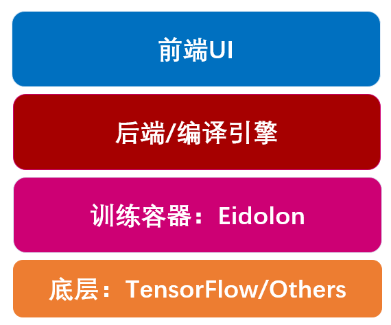
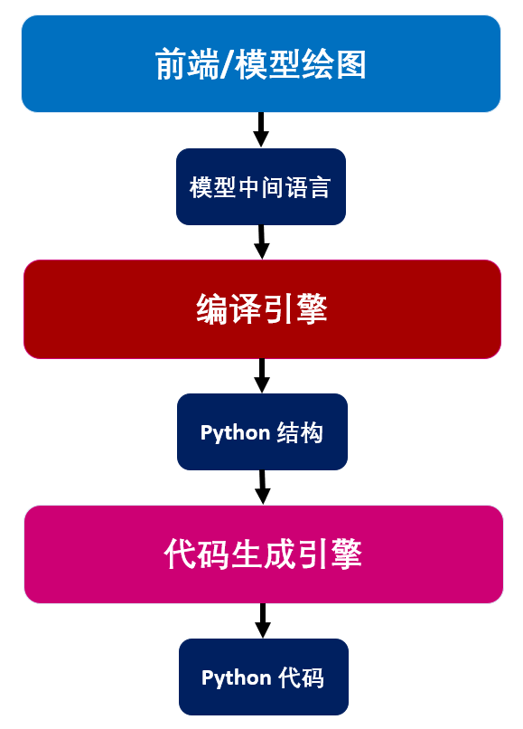

# Deep Studio
 A studio to design and build deep learning applications without codes.

# 什么是 Deep Studio?
Deep studio 是本人正在设计的一个低代码/无代码化平台，用于设计和构建深度学习应用。
#
## 前言
低代码与无代码化一直是我在探究的一个方向，我猜也是IT行业将来的一个重大变革。事实上，我始终觉得今天的程序员与一个世纪前的建筑工人相差无几，我们都是在从无到有，将脑海中的、图纸上的内容转变成实体。他们在工地搬砖；我们在办公室搬代码。只是，建筑行业发展至今已经相当成熟了，而IT行业的寿命还太短，还没有统一的规范，大家都是摸着石头过河。至于程序员的薪资相比建筑工人要高得多，是因为这些年，这个行业确实给人们的生活带来了翻天覆地的变化（很多人都误以为薪资和工作难度相关，实际上是和行业需求相关）。

这个状态是否会一直持续呢？很难说。但从历史的发展来看，似乎并不乐观。仅仅回顾过去三十年，还记得我妈妈这一辈人，在报社工作是一件多么光荣的事，但今天看来，互联网已经把这个行业冲击得所剩无几了。这类例子比比皆是。也许，将来哪一天，程序员也会沦为一个普通职位，就像银行的柜员一样。

会是什么导致这种变化？也很难预测，有人说人工智能会替我们写代码（总有人幻想着人工智能会取代一切），很有诱惑力，遗憾的是，在有限的时间内，似乎还看不到可能。我想说的是另一种趋势，行业的自我革命：低代码/无代码化。虽然这件事还很不成熟，但已经有些头绪。微软目前宣称的四朵云：`Azure`，`Microsoft 365`，`Dynamics 365`，还有一朵云是 `Power Platform`，它致力于为人们提供一个更加强大的数字化工具，其结果就是效率提高，成本降低，自动化增强。显然，低代码化是对用户说的，而为了开发该平台需要付出大量的代码成本。因此，这项概念显然会淘汰一部分仅注重搬砖的程序员，比如时常在论坛争论 `java` 和 `python` 哪个好的那一类人。但这项技术会给IT届带来新机遇，因此我把他称作自我革命。

我对写代码本身没什么兴趣，但对构建产品感兴趣，若这项产品能够改变一些事，哪怕是小浪花，就更能令我兴奋。当然，我一个人做不了市值第一的科技公司所能完成的事，因此打算从我自身的需求上出发，把目光聚焦在一个小点上：深度学习项目无代码化构建。事实上，这一小点对于我一个人来说还是略大。但在毕业前的这段时间，疫情给我带来了许多时间，还是做了一些事并计划继续做下去。

做深度学习两年时间，觉得写这些代码总有些乏味，但却要花上不少时间。而事实上，无论是构建模型的代码，亦或是训练过程，都是写模板代码，除了繁琐之外并没有多少技术含量。而我希望通过可视化的方式(比如以拖拽组件的方式)创建模型，自动编译成代码，并自动训练。
#
## 顶层设计

目前，我的顶层设计框架如下：

* `前端UI` 致力于与用户可视化交互，包括数据集相关操作、模型可视化设计（拖拽绘制等）、训练可视化与实时反馈等。

* `后端引擎` 默默为前端服务，包括将用户操作编译为运行代码（模型代码与训练流程代码）、监控训练日志等。

* `训练框架` 使用本人设计的 `Eidolon`， 管理深度学习的整个训练生命周期。 其训练算法允许接入主流的深度学习框架 `Tensorflow`等。可参考：https://github.com/happyyuwei/Eidolon-Tensorflow。

#
## 规划
现阶段已经完成部分编译引擎工作，其设计流程如下：
> `视图`->`模型中间语言`->`编译器`->`Python结构`->`代码生成`->`可执行代码`

其次，底层训练容器与运行时基本已经设计完成，且 `Eidolon` 已经被本人用于训练多个深度学习项目，结构如下。

较为困难的是前端部分，目前的选型还尚未确定，包括考虑：Web 端或者客户端、UI 框架与语言选型、绘图引擎与拖拽组件库选型（目前尚未找到特别优秀的拖拽组件库，若考虑自研，则精力成本过高）。

## 功能细节
1. 创建工作环境（workspace）。工作区是训练工程的基本单位，其中可进一步划分为app1,app2,...。所有一个工作区中的app公用一套训练代码，但可以通过配置文件修改训练参数。

2. workspace目录下包括app子目录，src子目录，dataset子目录等。

3. app是训练过程的基本单位。

